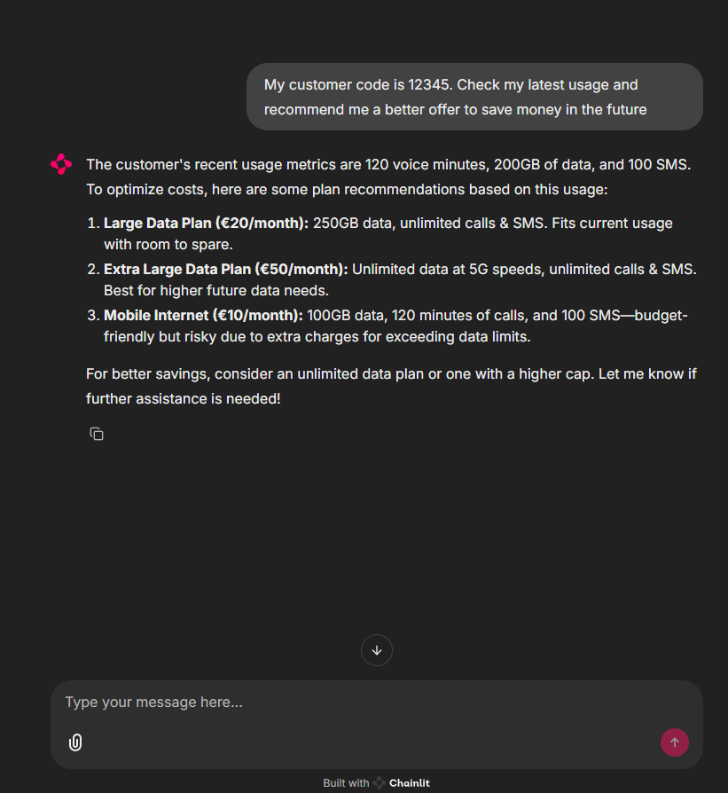
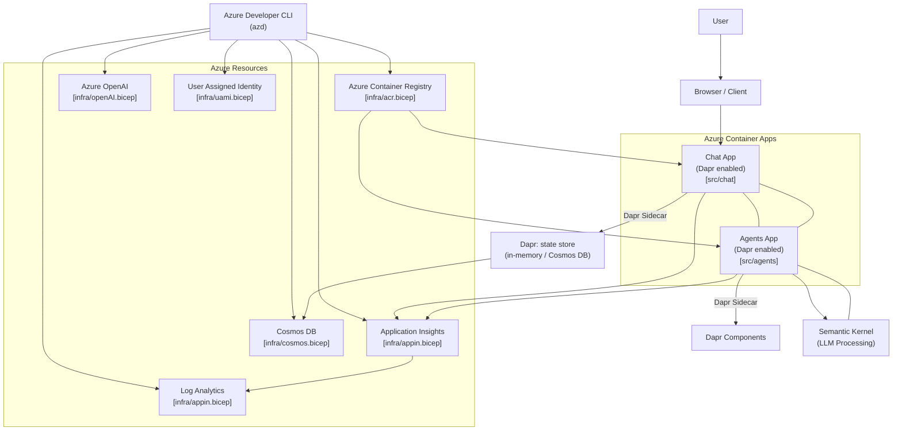

# Semantic Kernel Advanced Customer Support

This repo contains a sample customer support application that uses [Semantic Kernel](https://github.com/microsoft/semantic-kernel) Agents levering an improved [`SelectionStrategy`](src/agents/sk_ext/speaker_election_strategy.py) that accounts for agents descriptions and available tools to provide a more accurate selection (including the reason for it for traceability).

It also features _nested orchestration_ via [`Teams`](src/agents/sk_ext/team.py) and `Agents` for more complex, hierarchical routing scenarios.

It also includes a special kind of
`Agent` that constructs a [`PlannedTeam`](src/agents/sk_ext/planned_team.py) where more complex asks are turned into a multi-step process.

## Example



## Architecture

The overall architecture involves [Dapr](https://dapr.io) to enable the [_Virtual Actor pattern_](https://docs.dapr.io/developing-applications/building-blocks/actors/actors-overview/), in order to host the agentic team and natively handle `ChatHistory` persistence via Dapr's [state store](https://docs.dapr.io/developing-applications/building-blocks/state-management/).



## Getting Started

### Prerequisites

- **Python 3.12+**
- [**Azure Developer CLI**](https://learn.microsoft.com/en-us/azure/developer/azure-developer-cli/install-azd?tabs=winget-windows%2Cbrew-mac%2Cscript-linux&pivots=os-windows) – To deploy and manage Azure resources.
- **Docker** and [**Dapr CLI**](https://docs.dapr.io/getting-started/install-dapr-cli/) – To run the application locally.

### Clone the repo

```bash
git clone https://github.com/Azure-Samples/mas-sk-quickstart
cd mas-sk-quickstart
```

### Azure Deployment

```bash
# Login to Azure if required
azd auth login --tenant-id <TENANT>.onmicrosoft.com

azd up

# When prompted, select
# - Azure subscription to deploy to
# - Azure region to deploy to
# - Azure OpenAI resource and group to use
```

### Running Locally

1. `cp .env.example .env`
2. Update `.env` with your Azure OpenAI resource endpoint
3. Ensure Docker is running.
4. Init Dapr (once only): `dapr init`.

To run:

`dapr run -f dapr.yaml`

## Contributing

This project welcomes contributions and suggestions. Please see [CONTRIBUTING.md](CONTRIBUTING.md) for details.

## License

This project is licensed under the MIT License. See [LICENSE.md](LICENSE.md) for details.
